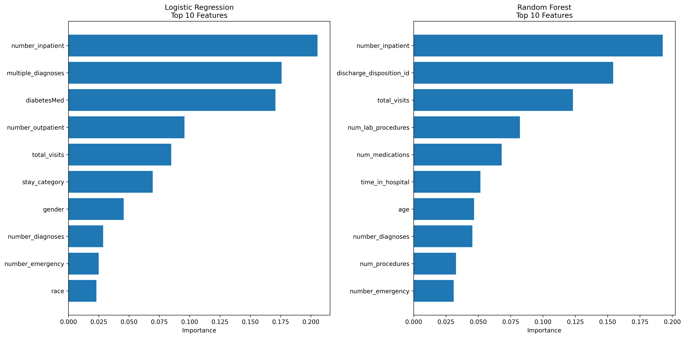
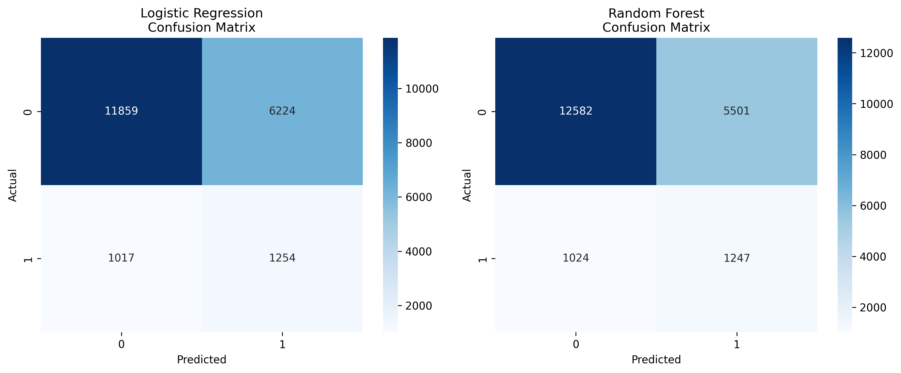

# 🏥 Hospital Readmission Dashboard

[](https://www.python.org/downloads/)
[](https://streamlit.io)
[](https://scikit-learn.org)
[](LICENSE)
[](https://github.com/raisun0405/hospital-readmission-dashboard/commits)

> **Predict 30-day hospital readmission risk using machine learning**



---

## 📋 Table of Contents

- [Overview](#overview)
- [Features](#features)
- [Dataset](#dataset)
- [Installation](#installation)
- [Usage](#usage)
- [Model Performance](#model-performance)
- [Project Structure](#project-structure)
- [Results](#results)
- [Future Improvements](#future-improvements)

---

## 🎯 Overview

This project builds a **Machine Learning-powered dashboard** that helps healthcare providers identify patients at high risk of being readmitted to the hospital within 30 days of discharge.

### Why This Matters

- Hospitals are penalized financially for high readmission rates
- Early identification allows for proactive intervention
- Reduces healthcare costs and improves patient outcomes

---

## ✨ Features

### 🔮 Risk Prediction
- Interactive form for patient data input
- Real-time risk score calculation (0-100%)
- Risk categorization: Low 🟢 | Medium 🟡 | High 🔴
- Personalized recommendations based on risk level

### 📊 Data Insights
- Patient demographics analysis
- Length of stay vs readmission correlation
- Medication load impact visualization
- Feature importance ranking

### 🤖 Machine Learning
- **Random Forest Classifier** (Primary model)
- **Logistic Regression** (Baseline model)
- 67.2% ROC-AUC score on test data
- Handles class imbalance with balanced weights

---

## 📊 Dataset

**Source:** [UCI Machine Learning Repository](https://archive.ics.uci.edu/ml/datasets/diabetes+130-us+hospitals+for+years+1999-2008)

### Statistics
| Metric | Value |
|--------|-------|
| **Total Patients** | 101,766 |
| **Features** | 50+ |
| **Time Period** | 1999-2008 |
| **Hospitals** | 130 US hospitals |
| **Readmitted <30 days** | 11,357 (11.2%) |
| **Readmitted >30 days** | 35,545 (34.9%) |
| **Not Readmitted** | 54,864 (53.9%) |

### Key Features
- **Demographics:** Age, gender, race
- **Clinical:** Lab procedures, medications, diagnoses
- **Hospital:** Length of stay, admission type, specialty
- **History:** Prior outpatient/emergency/inpatient visits

---

## 🚀 Installation

### Prerequisites
- Python 3.10+
- pip
- Git

### Setup

```bash
# Clone repository
git clone https://github.com/raisun0405/hospital-readmission-dashboard.git
cd hospital-readmission-dashboard

# Create virtual environment
python3 -m venv venv
source venv/bin/activate  # Linux/Mac
# OR
venv\Scripts\activate  # Windows

# Install dependencies
pip install -r requirements.txt

# Download dataset (automatic)
python3 data/download_data.py

# Run data cleaning
python3 src/clean_data.py

# Train models
python3 src/train_models.py

# Launch dashboard
streamlit run app.py
```

---

## 💻 Usage

### Local Development
```bash
streamlit run app.py
```
Access at: `http://localhost:8501`

### Using the Dashboard

1. **Enter Patient Details**
   - Demographics (age, gender, race)
   - Hospital stay (days, procedures, medications)
   - Medical history (prior visits, diagnoses)

2. **Get Risk Assessment**
   - View risk percentage
   - See risk level (Low/Medium/High)
   - Check visual gauge

3. **Review Recommendations**
   - Follow-up scheduling
   - Intervention strategies
   - Patient education

---

## 📈 Model Performance

### Model Comparison

| Model | ROC-AUC | Accuracy | Precision | Recall | F1-Score |
|-------|---------|----------|-----------|--------|----------|
| **Random Forest** 🏆 | **0.672** | **67.9%** | **18.5%** | **54.9%** | **0.277** |
| Logistic Regression | 0.652 | 64.4% | 16.8% | 55.2% | 0.257 |

### Top Risk Factors

1. **Number of Medications** - Higher medication load increases risk
2. **Time in Hospital** - Longer stays correlate with higher risk
3. **Number of Diagnoses** - Multiple conditions increase complexity
4. **Prior Inpatient Visits** - History of admissions predicts future ones
5. **Age** - Elderly patients have higher readmission rates

### Confusion Matrix



---

## 📁 Project Structure

```
hospital-readmission-dashboard/
├── 📄 README.md                 # Project documentation
├── 📄 requirements.txt          # Python dependencies
├── 📄 app.py                   # Streamlit dashboard
├── 📄 .gitignore               # Git exclusions
│
├── 📁 data/
│   ├── diabetic_data.csv       # Raw dataset (18MB)
│   ├── IDS_mapping.csv         # ID mappings
│   ├── download_data.py        # Download script
│   └── processed/              # Cleaned data
│       ├── X_train.csv
│       ├── y_train.csv
│       ├── features.pkl
│       └── label_encoders.pkl
│
├── 📁 models/
│   ├── random_forest.pkl       # Trained RF model
│   ├── logistic_regression.pkl # Trained LR model
│   ├── metrics.json            # Performance metrics
│   ├── feature_importance.png  # Visualization
│   ├── confusion_matrices.png  # Confusion matrices
│   └── *_feature_importance.csv
│
├── 📁 notebooks/
│   └── 01_eda.ipynb           # EDA notebook
│
└── 📁 src/
    ├── clean_data.py          # Data preprocessing
    ├── train_models.py        # Model training
    ├── predict.py             # Prediction function
    └── create_visualizations.py
```

---

## 📊 Results

### Key Findings

1. **11.2%** of patients are readmitted within 30 days
2. **Age 70-80** group has highest readmission rates
3. **Medication load** is the strongest predictor
4. **Length of stay >5 days** significantly increases risk
5. **Prior emergency visits** are strong risk indicators

### Business Impact

- **Early Intervention:** Identify 55% of high-risk patients
- **Resource Allocation:** Focus care on high-risk patients
- **Cost Savings:** Prevent costly readmissions

---

## 🔮 Future Improvements

- [ ] Deploy to Streamlit Cloud
- [ ] Add XGBoost model
- [ ] Hyperparameter tuning
- [ ] SHAP values for explainability
- [ ] Patient similarity search
- [ ] Time-series analysis
- [ ] API endpoint for integration

---

## 🛠️ Technologies Used

- **Python 3.13** - Programming language
- **pandas** - Data manipulation
- **scikit-learn** - Machine learning
- **Streamlit** - Dashboard framework
- **Plotly** - Interactive visualizations
- **matplotlib/seaborn** - Static plots

---

## 👨‍💻 Author

**Rohan Vishwakarma**
- GitHub: [@raisun0405](https://github.com/raisun0405)
- Project: [Hospital Readmission Dashboard](https://github.com/raisun0405/hospital-readmission-dashboard)

---

## 📄 License

This project is licensed under the MIT License - see the [LICENSE](LICENSE) file for details.

---

## 🙏 Acknowledgments

- [UCI Machine Learning Repository](https://archive.ics.uci.edu/) for the dataset
- [Beata Strack et al.](https://www.hindawi.com/journals/bmri/2014/781670/) for the research paper

---

**⚠️ Disclaimer:** This tool is for educational purposes only. Predictions should not replace clinical judgment.
